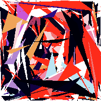

# Face-Stylization

### Contents

Use triangles to fit a face and recolor it in a abstract style. The core idea is to find the approximation of a target image using triangles and recolor the triangles in certain colors.

Still in development and optimization.

<center>
    
    
    <br>
    <div style="color:orange; border-bottom: 1px solid #d9d9d9;
    display: inline-block;
    color: #999;
    padding: 2px;">
      origin, triangle-fit, recolored
  	</div>
</center>

<center>
    
    
    <br>
    <div style="color:orange; border-bottom: 1px solid #d9d9d9;
    display: inline-block;
    color: #999;
    padding: 2px;">
      origin, triangle-fit, recolored
  	</div>
</center>

<center>
    
    
    <br>
    <div style="color:orange; border-bottom: 1px solid #d9d9d9;
    display: inline-block;
    color: #999;
    padding: 2px;">
      origin, triangle-fit, recolored
  	</div>
</center>

<center>
    
    
    <br>
    <div style="color:orange; border-bottom: 1px solid #d9d9d9;
    display: inline-block;
    color: #999;
    padding: 2px;">
      origin, triangle-fit, recolored
  	</div>
</center>

<center>
    
    
    <br>
    <div style="color:orange; border-bottom: 1px solid #d9d9d9;
    display: inline-block;
    color: #999;
    padding: 2px;">
      origin, triangle-fit, recolored
  	</div>
</center>

<center>
    
    
    <br>
    <div style="color:orange; border-bottom: 1px solid #d9d9d9;
    display: inline-block;
    color: #999;
    padding: 2px;">
      origin, triangle-fit, recolored
  	</div>
</center>

<center>
    
    
    <br>
    <div style="color:orange; border-bottom: 1px solid #d9d9d9;
    display: inline-block;
    color: #999;
    padding: 2px;">
      origin, triangle-fit, recolored
  	</div>
</center>

### Run

```
python fit.py TargetImage.png
```

Number of triangles can be adjusted in `fit.py`. 

### Plan

The current running speed of the program is relatively slow. 

To do:

1. Align the triangles around the edges of the face
2. Adjust the coloring strategy to make the coloring more consistent with the semantics of the facial organs
3. Optimize the speed


### 

